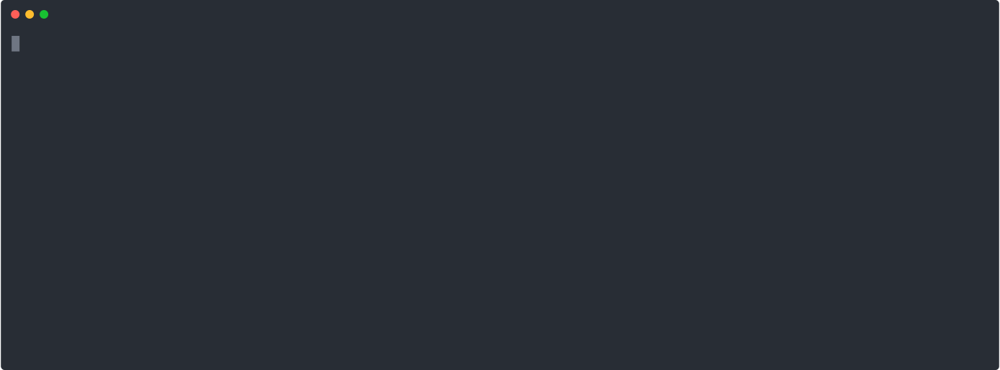

# asmago (AWS SSM Manager Golang)

`asmago` is a command-line interface (CLI) tool built with Go to simplify and accelerate workflows when interacting with AWS Systems Manager (SSM). This tool is specifically designed to make it easier to start sessions into EC2 instances and to port-forward to RDS databases through a bastion host.

Its main feature is a smart shortcut system that learns from your usage, displaying your most frequently used options at the top for faster access.



---

## Key Features

- **Interactive Workflow**: A command-line session that guides the user step-by-step, from selecting an AWS profile and instance to choosing the desired action.
- **Smart Shortcuts**: Automatically creates and manages shortcuts based on the scenarios you run. The more you use a flow, the higher its priority becomes.
- **Cross-Platform Support**: Compiles and runs on Windows, macOS, and Linux.
- **Automatic SSO Token Handling**: Detects if an AWS SSO token has expired and automatically refresh it.
- **Automatic Initialization**: On first run, `asmago` will automatically copy the `rds.json` configuration file to the user's configuration directory.
- **Dry Run Mode**: See the AWS command that would be run without actually executing it, great for verification and debugging.
- **Data Management**: A `clean` command to easily reset all shortcut data and usage history.

## Prerequisites

Before using `asmago`, ensure you have installed and configured:

1. **AWS CLI v2**: This tool depends on the AWS CLI to execute commands against AWS. Make sure `aws` is accessible from your system's PATH.
2. **Session Manager Plugin**: The plugin for the AWS CLI required to start sessions. Follow the [official AWS installation guide](https://docs.aws.amazon.com/systems-manager/latest/userguide/session-manager-working-with-install-plugin.html).
3. **AWS Profiles**: You must have profiles configured in `~/.aws/config`, especially for AWS SSO authentication.

## Installation & Usage

The easiest way to use `asmago` is to download the distribution package for your operating system from the project's releases page.

1. **Download and Extract**: Download the `.zip` or `.tar.gz` file for your OS and extract its contents. You will get a directory containing:
    - `asmago` (or `asmago.exe` on Windows)
    - `start-asmago.bat` (launcher for Windows only)

2. **Create your own rds.json**
    Go to the extracted directory. create `config/` folder and create `rds.json` file inside it with the following structure:

    ```json
    [
        {
            "key": "you name it",
            "env": "anything but would be better if match with prefix of the instances",
            "type": "read or write",
            "endpoint": "your-rds-endpoint.amazonaws.com",
            "port": 3306,
            "local_port": 3307
        },
        # example
        {
            "key": "my_database",
            "env": "dev",
            "type": "read",
            "endpoint": "dev-my-database.cluster-ro-abcde0fgh1jk.ap-southeast-1.rds.amazonaws.com",
            "port": 3306,
            "local_port": 3307
        }
    ]
    ```

3. **Run the Application**:
    Open a terminal, navigate to the extracted directory, and run the application:

    ```bash
    # On macOS or Linux
    ./asmago

    # On Windows
    .\asmago.exe
    ```

    > **[Tips]** For Windows, you can also run it by simply double click on `start-asmago.bat`. It will do the same thing as well.

    On the first run, `asmago` will automatically copy `config/rds.json` to the correct location in your user's home directory.

4. **(Optional) Move to PATH**:
    To be able to run `asmago` from any directory, move the `asmago` file to a directory that is in your system's `PATH` (e.g., `/usr/local/bin` on macOS/Linux).

## Command List

### **Start an Interactive Session**

This is the default mode. Simply run the application name.

```bash
asmago
